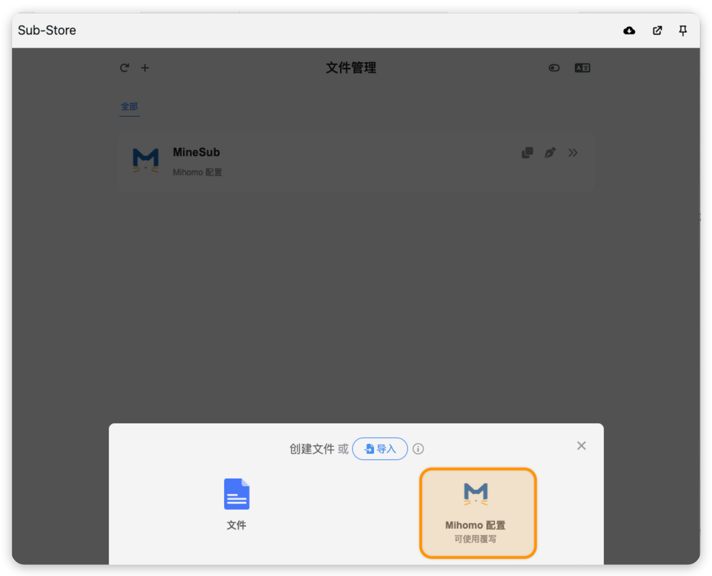
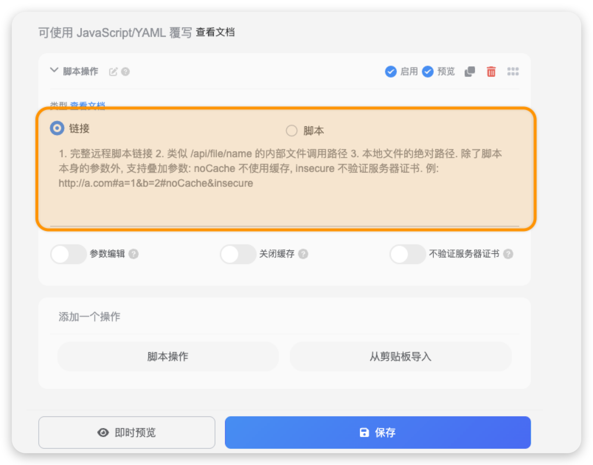

# rrorange-override-hub
自用 sub-store 订阅规则

## 使用方法

1. 自行添加一个组合订阅

2. 在 `文件管理` 添加一个 `Mihomo 配置`

3. 在 `Mihomo 配置` 中`脚本操作`添加一个 `链接`

> https://raw.githubusercontent.com/zhiyu1998/rrorange-override-hub/refs/heads/main/sub_manager.js

> [加速订阅](https://mirrors.seaya.link/)：https://mirrors.seaya.link/https://raw.githubusercontent.com/zhiyu1998/rrorange-override-hub/refs/heads/main/sub_manager.js

