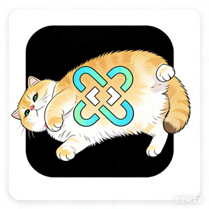

<div align="center">
  
  
  <h1>rrorange-override-hub</h1>
  <p><strong>自用 sub-store 订阅规则</strong></p>
</div>

---

## 📖 使用方法

### 步骤 1：添加组合订阅

自行添加一个组合订阅

<br>

<div align="center">
  
</div>

<br>

### 步骤 2：添加 Mihomo 配置

在 <code>文件管理</code> 中添加一个 <code>Mihomo 配置</code>

<br>

<div align="center">
  
</div>

<br>

### 步骤 3：添加脚本链接

在 <code>Mihomo 配置</code> 中的 <code>脚本操作</code> 添加一个 <code>链接</code>

<br>

<div align="center">
  
</div>

<br>

#### 📋 链接地址：

**官方链接：**
```bash
https://raw.githubusercontent.com/zhiyu1998/rrorange-override-hub/refs/heads/main/file_manager.js
```

**加速订阅链接：**
```bash
https://mirrors.seaya.link/https://raw.githubusercontent.com/zhiyu1998/rrorange-override-hub/refs/heads/main/file_manager.js
```

---

<div align="center">
  <p><em>如有问题，请提交 Issue</em></p>
</div>